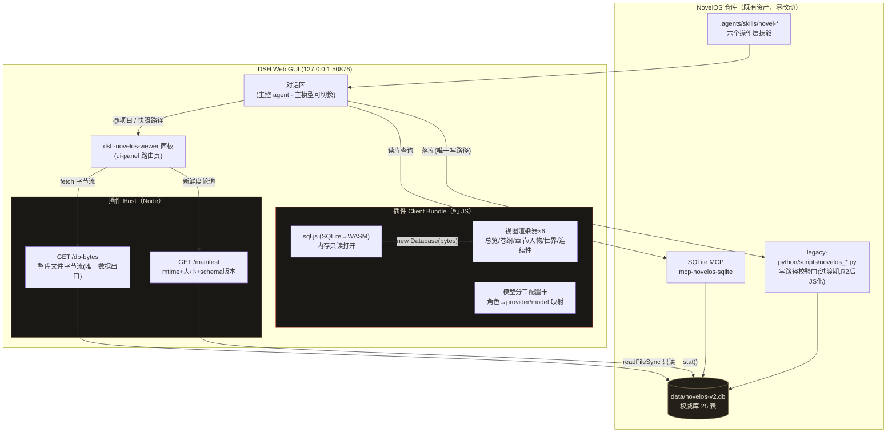
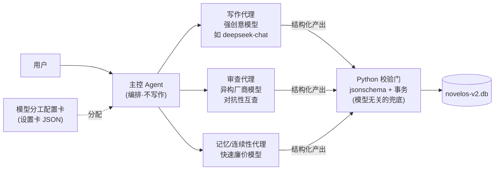

# NovelOS Viewer · 产品架构与原型说明

> 产品定位：NovelOS 权威库的**纯只读可视化工作台**——DSH ui-panel 插件形态，浏览器内 sql.js(WASM) 直读 `data/novelos-v2.db`，全 JS 渲染，零 Python 参与视图链。
> 设计原则继承自对抗审查报告（`docs/plugin-feasibility-adversarial-review.md`）：快照制新鲜度 / 物理只读 / 零写路径 / 零 argv / 单渲染器。

---

## 一、产品架构图

### 关键边界（红队整改项逐一落实）

| 边界 | 设计 |
|---|---|
| **物理只读** | sql.js 将 db 全量载入内存，WASM 实例无任何回写 API——面板结构上不可能污染权威库 |
| **零子进程** | 视图链无 Python spawn → cp936 编码雷 / 退出码歧义 / 僵尸进程三类 P0 整体消失 |
| **零参数注入面** | host 路由无任何入参，repoRoot 编译期常量——F3 路径穿越无从谈起 |
| **单渲染器** | HTML(JS) 是唯一人类视图；md 投影退役；模型侧走 SQLite MCP——无双实现漂移 |
| **快照新鲜度** | 页面常驻显示 db 文件 mtime+体积；「刷新」= 重拉字节流重建 WASM 实例 |
| **已知遗留（中危）** | db 字节经 50876 无鉴权可下载——本地单人使用可接受，后续可加 Host 校验 |

## 二、Agent 多模型分工架构

- 分配规则存于设置卡（角色→provider/model），改配置不改代码；
- 校验门在脚本层不依赖模型自觉——换弱模型只会 FAIL 阻断，不会脏库；
- 审查端刻意用异构厂商模型，利用「不同模型盲区不同」提升审查多样性。

## 三、信息架构（面板六视图）

1. **总览**——书卡（卷数/章数/字数/进度条）+ 各资产状态徽章（candidate/locked/stale 计数）
2. **卷纲**——卷型时间轴：每卷高潮门位置、单元编排、线弧跨度
3. **章节流**——按卷分组的状态流水（draft/review/accepted），点开看正文只读预览
4. **人物**——名册卡（席位/状态活死/出场卷分布）
5. **世界**——规则条目 + 势力/地点/物品索引
6. **连续性**——六账本候选与晋升状态 + 人物状态史审计

## 四、原型图

高保真交互原型见 [novelos-viewer-prototype.html](./novelos-viewer-prototype.html)（双击浏览器打开即可，内嵌模拟数据，布局即开发规格）。
